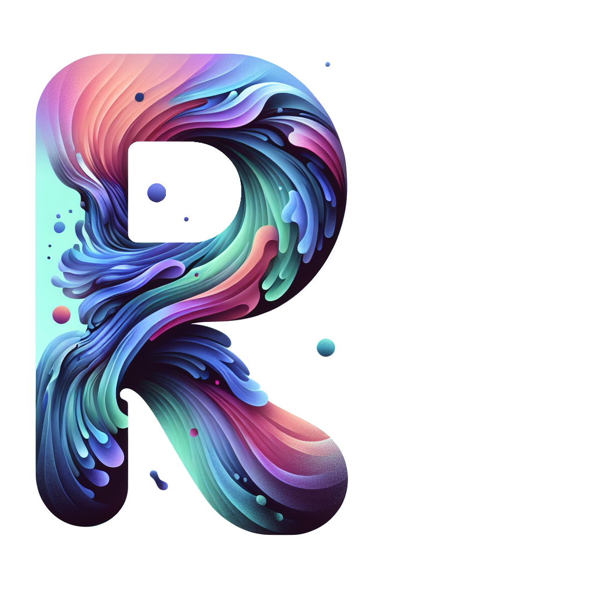

# Rhea (Pre-Alpha)

## Overview

Rhea is an overly ambitious iOS- and iPadOS-native code editor, currently in its very early stages of development. Our goal is to bring a worthy editor and lightweight development environment to your iPad and iPhone. Leveraging remote processing, we overcome platform limitations to deliver a productive coding experience.

⚠️ **Please Note**: Rhea is currently in a pre-alpha state. Many features are not yet implemented or fully functional. Use at your own risk and expect frequent changes and potential instability.

## Current Status

-  Basic file system navigation
-  Initial syntax highlighting
-  File creation and deletion (in development)

## Remote Capabilities

To tackle the inherent limitations of iOS/iPadOS for full-featured coding, Rhea will offload tasks such as:

-  **Code Compilation**: Swift, Python, and more, executed on remote servers.
-  **Version Control**: Integration with Git to manage code repositories.
-  **Resource-Intensive Operations**: Run CI/CD processes and testing suites externally.

## Roadmap

-  Enhance remote execution stability and speed
-  Expand language support and syntax highlighting
-  Implement code completion features
-  Introduce theming and customization options
-  Develop split view and multi-file editing capabilities

## Contributing

While we're excited about the potential of Rhea, it's not yet ready for contributions. We'll open up for community involvement once we have a more stable foundation.

## Feedback

Feel free to open an issue with your ideas or feature requests.

## Disclaimer

Rhea is currently a prototype and should not be used for any critical or production work. Data loss or corruption is pretty much guaranteed. Always backup your work when testing Rhea.

## Stay Tuned

We're working hard to bring Rhea to life. Follow this repository for updates as development continues.
